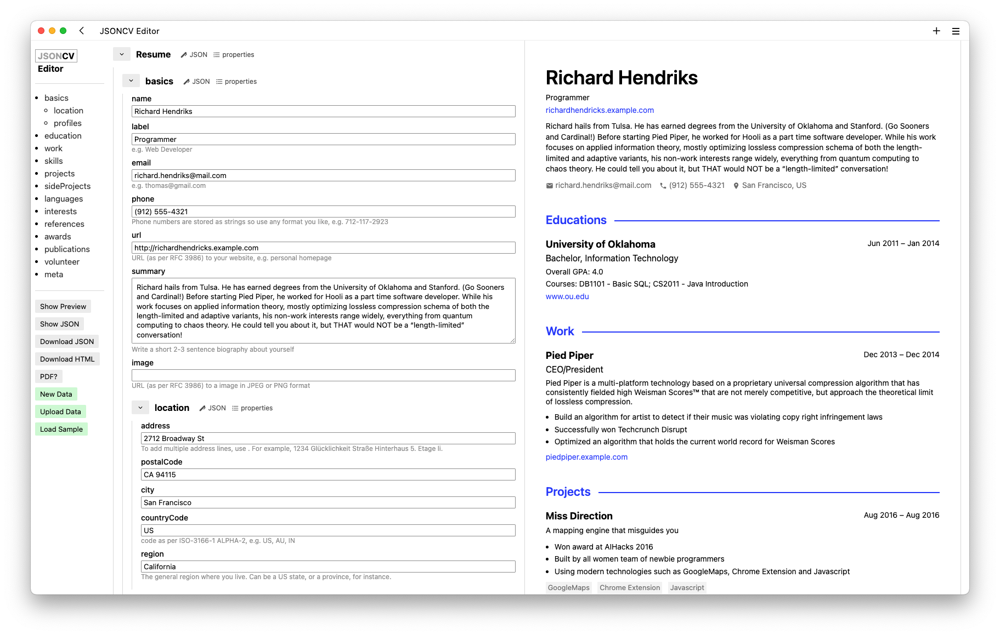
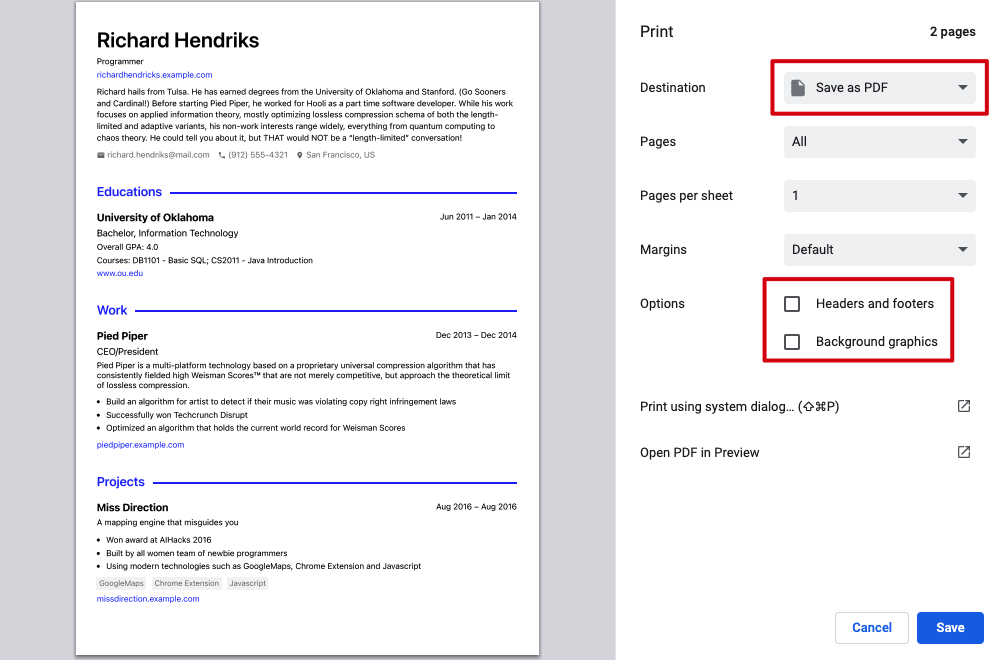
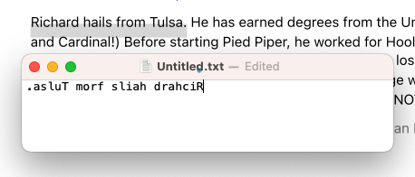

# jsoncv

A toolkit for building your CV with JSON and creating stylish HTML/PDF files.

jsoncv comprises the following components:
1. Schema
2. Editor
3. CV HTML
4. Converters

For in-depth explanations and usage guidelines, please refer to the documentation below.


## Introduction

### Schema

jsoncv use [JSON Schema](https://json-schema.org/) to create JSON-based standard for CVs.

The schema used in jsoncv is a fork of the [JSON Resume Schema](https://jsonresume.org/schema/),
with the following differences:

- JSON Schema version

    JSON Resume utilizes the outdated draft-04 version, while jsoncv uses the current draft-07. To ensure compatibility with draft-07, all instances of `additionalItems` have been removed.
- Additional `sideProjects` section

    jsoncv includes an additional section, called `sideProjects`, that allows for the distinction between side projects and career projects
- Additional `name` property in `meta` section

    jsoncv includes a `name` property in the `meta` section, which allows the user to specify the desired name for exported HTML/PDF files.

These differences do not impact the compatibility between jsoncv and JSON Resume. This means that you can easily import JSON Resume data into jsoncv and vice versa, as jsoncv data will pass the validation of JSON Resume Schema .

The complete diff between the JSON Resume schema and the jsoncv schema can be viewed [here](https://github.com/reorx/jsoncv/compare/eabd65fd5a9a126e2de9e2955485c0dca4483c79...master#diff-3b8e847cb1664e291a7635b037a2f2bf831e1e9ce2d915fbfbba9ca77e2a1d1b)

### Editor



jsoncv comes with an online editor that provides a graphical user interface for creating and editing your jsoncv data.
Visit it at https://jsoncv.reorx.com/editor/.

The Editor consists of three panes, from left to right:

1. Sidebar

    Allows navigation to different sections in the schema form and provides operations such as "Download HTML" and "Upload Data"
2. Schema Form

    Lets you edit the properties of your CV data. You can also select which properties to display or hide.
3. Preview

    Displays the rendered CV HTML as changes are made in the Schema Form.

### CV HTML

The core product of jsoncv is CV HTML, which is the HTML representation of your jsoncv data.
It is a compact, single-file HTML document that can be converted to PDF or hosted online to create a static CV website.

CV HTML is designed with a specific layout to display a CV on an A4 sheet of paper.
The CSS has been tailored to optimize printing, ensuring the best typography whether printed on paper or saved as a PDF.
Therefore, CV HTML is best suited for creating professional or academic CVs/resumes,
rather than creative or interactive portfolio websites.

CV HTMl supports themes, which can be found in the `src/themes` directory.

To get CV HTML, please refer to [Export CV data and HTML](#export-cv-data-and-html) and [Build HTML locally](#build-html-locally)

### Converters

Converters are scripts to help user converting jsoncv data from/to other sources.

Currently, there is only one converter available: `rxresume-to-jsoncv.js`, which converts data exported from [RxResume](https://rxresu.me/) into the jsoncv format.

If you have any additional requirements, please feel free to submit an issue. Pull requests are also greatly appreciated.


## Usage

### Write your CV

It is recommended to write your CV using the online [Editor](https://jsoncv.reorx.com/editor/).
However, if you are comfortable with JSON, you can maintain the data file using a text editor on your local machine.

When you open the Editor for the first time, a sample data is loaded.
You can either edit it or click the "New Data" button to start with an empty form.
Your CV data is saved in your browser every time you make a change,
so you don't have to worry about losing your work.

If you already have a local copy of your CV data, you can click the "Upload Data" button to load it into the Editor.

### Export CV data and HTML

Once you have finished editing, you can click the **Download JSON** button to export your CV data in JSON format.

If you want to export the rendered HTML in the Preview pane, simply click the **Download HTML** button.

Please note that you can name the exported files by adding the `meta.name` property.
If it is not specified, the filename will be constructed using a combination of `basics.name` and `meta.version`.

### Convert HTML to PDF

To keep things simple, jsoncv does not include or use any external tools to generate PDFs.
Instead, you should use the generated HTML file to convert it to a PDF document.
The only requirement is a modern browser; the steps below use Google Chrome as an example:

1. Open the generated HTML file in Chrome.
2. Press <kbd>⌘ P</kbd> (or <kbd>⌃ P</kbd> in Windows), and the Print dialog will open.
3. In the dialog, select "Destination" as "Save as PDF" and make sure all items in "Options" are unchecked.

    
4. Click "Save" to save the PDF file in your file system.

Please note that the PDF exported from Chrome may have some issues with text copying. For more information, see the [FAQ](#text-copied-from-the-pdf-is-reversed) section.

### Build HTML locally

jsoncv uses [Vite](https://vitejs.dev/) as its static-site building tool.
The `index.html` file in the root of the project is the entry point for builing a single-file CV HTML.

Here are the steps to build a CV HTML using your own data:

1. Make sure that you are using NodeJS version 18 or higher.
2. Install the dependencies by running: `npm run install`
3. Build your CV HTML by specifying `DATA_FILENAME` and `OUT_DIR` environment variables:

    ```
    DATA_FILENAME="$HOME/Downloads/mycv/cv.json" OUT_DIR="$HOME/Downloads/mycv" npm run build
    ```

    This will build your CV HTML using the data file located at `$HOME/Downloads/mycv/cv.json`,
    and the generated HTML will be located in the `$HOME/Downloads/mycv` directory.

The following environment variables are supported in the build process:
- `DATA_FILENAME`: The CV data to use, can be a relative or absolute path.
- `OUT_DIR`: The output directory for the generated HTML file.
- `THEME`: The theme to use, must be one of the directory name in `src/themes/`.

To customize the primary color of the theme, modify the --primary-color CSS variable in index.scss.
Note that making this change will result in unstaged changes in Git. If you want to build the HTML yourself,
it is recommended that you create a new project instead of editing the source code in jsoncv.
For instructions on how to do this,
please refer to the [Build a static CV site](#build-a-static-cv-site) section.

### Build a static CV site

The generated `index.html` file can be used anywhere and on any hosting platform.
Simply upload it to a web server, and you will have your own online CV site.
The built-in theme "reorx" also includes responsive support for mobile devices.

However, if you want extra customization, like the CV site at https://cv.reorx.com/
which has a footer with links to the PDF file and the author's home page,
you can follow these steps:

1. Create an empty repository
2. Add jsoncv as the submodule

    ```
    git submodule add https://github.com/reorx/jsoncv.git
    ```
3. Put your CV data file, for example `cv.json`, in the project.
4. Initialize `package.json` by running `npm init`.
5. Install jsoncv as a dependency by running `npm i ./jsoncv`.
6. Copy the `scripts` and `devDependencies` from `./jsoncv/package.json` to `package.json`, and then run `npm i` to install them.
7. Copy `./jsoncv/vite.json.js` to `vite.json.js` and make the following changes:
   - Change all instances of `./src` to `./jsoncv/src`.
   - Change the value of `dataFilename` to your CV data file, for example `cv.json`.
   - Change `renderData.theme` to the theme you want to use.
8. Copy `./jsoncv/index.html` to `index.html` and change all instances of `./src` to `./jsoncv/src`.
   Then Copy `./jsoncv/index.scss` to `index.scss`.
9. Run `npm run build` to test if everything works.

After completing these steps, you can now add your own elements and styles to `index.html` and `index.scss`
to further customize your CV website. You can use HTML, CSS, and JavaScript to add
your own branding, layout, and functionality to the site.

### Create your own theme

jsoncv includes several built-in themes that you can use either directly in the Editor or when building the static CV site.
 If you want to create your own custom theme, here is how:

The file system hierarchy for themes is as follows:
```
src/themes
└── reorx
    ├── index.ejs
    └── index.scss
```

You can add your own theme by creating a new folder under `src/themes`
with `index.ejs` and `index.scss` files.

`index.ejs` is an [ejs](https://ejs.co/) template used for constructing the CV content.
The data that is passed to the template is structured as follows:
- `cv`: the entire jsoncv data that conforms to the jsoncv schema
- `fn`: a set of utility functions
  - `getCVTitle`: gets the CV title from `cv` data
  - `reformatDate`: transforms a date string to a specified format
  - `getIconSVG`: gets the iconify SVG string or DOM element from the icon name
  - `noSchemaURL`: remove the schema (`https://`) prefix of the url

For more information, see the complete definition in [src/themes/data.js](https://github.com/reorx/jsoncv/blob/master/src/themes/data.js).

Once you have created a new theme (let's use `yourtheme` as an example),
you can start developing and previewing it by running the following code:

```
THEME=yourtheme npm run dev-site
```

Pull requests for adding new themes are always welcomed.

> You can just name the theme after your own name, this is what I did for the theme "reorx".
> Because I think that theme is tightly bound to the developer's aesthetic and personal taste,
> and common words may not accurately represent the theme.


## Tech stack

- vite
- ejs
- scss
- iconify
- ajv


## FAQ

### Text copied from the PDF is reversed

Yes, this is a known issue with Chrome's "Save as PDF" feature.
The resulting PDFs can have text that is backwards when copied in Preview.app on MacOS.



This issue has been reported by several users and is not specific to jsoncv. As seen in:
["Save as PDF" produces documents with backwards text. - Google Chrome Community](https://support.google.com/chrome/thread/29061484/save-as-pdf-produces-documents-with-backwards-text?hl=en&dark=0)

Solution: Use Firefox or Safari to get the PDF


### The order of properties in the exported JSON changes sometimes

See [Does JavaScript guarantee object property order? - Stack Overflow](https://stackoverflow.com/questions/5525795/does-javascript-guarantee-object-property-order)

## TODO

- [x] Supports Markdown in `summary` and `description` properties
- [x] Allows customizing primary color for the current theme
- [x] Export PDF directly (using browser's print feature)
- [x] Supports responsive style for themes, so that the CV site is friendly to view on mobile devices.
- [ ] Add more themes.
- [ ] Allows switching themes in Editor
- [ ] Add more sample data. By clicking the "Load Sample" button, a dialog will open, allowing the user to select from various languages

## Credits

jsoncv could not be made possible without these awesome projects below:

- [JSON Resume](https://jsonresume.org/)
- [json-editor](https://github.com/json-editor/json-editor)
- [iconify](https://iconify.design/)


## Donation

If you think this project is enjoyable to use, or saves some time,
consider giving me a cup of coffee :)

- [GitHub Sponsors - reorx](https://github.com/sponsors/reorx/)
- [Ko-Fi - reorx](https://ko-fi.com/reorx)
